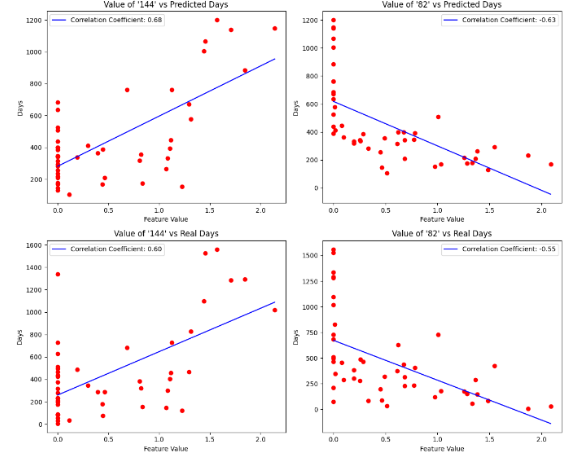
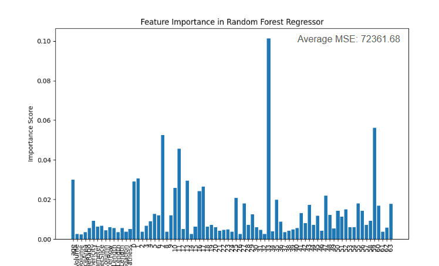
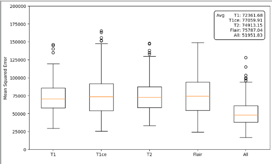

# Brain Tumor Survival Prediction (BrATS 2020)
**Award:** Honorable Mention in Graduation Project Competition (NTNU CS)

---

## 👤 My Role & Key Contributions
In this team project, I focused on the **Model Integration and Critical Feature Analysis** stages. My work was pivotal in identifying the key biological indicators and significantly improving prediction accuracy.

* **Hybrid Feature Analysis:** Spearheaded the integration of 1,000+ Radiomics features with CNN-extracted deep features, capturing both global morphology and local textures.
* **Feature Selection & Optimization:** Implemented **Lasso Regression** and **Random Forest** to filter out redundant data, successfully identifying the top 20 most predictive features.
* **Performance Breakthrough:** Through meticulous feature engineering and hyperparameter tuning, I led the team to reduce the **MSE from 150k to 72k (a 52% improvement)**.
* **Explainable AI (XAI):** Developed feature importance visualizations to provide clinical interpretability for survival predictions.

---

## 📊 Experimental Results
Below are the key visual outcomes from our survival prediction model:

### 1. Feature Importance Ranking
*Description: This chart showcases the most significant features identified during my analysis. I used Random Forest and Lasso to rank these indicators, providing insights into tumor heterogeneity.*

 


### 2. Prediction Performance (Random Forest Regression)
*Description: The regression results showing the correlation between predicted and actual survival days. Our optimized Hybrid Model achieved a 52% error reduction compared to the baseline.*



---

## 🛠️ Tech Stack
* **Language:** Python
* **Core Libraries:** PyTorch, Scikit-learn, PyRadiomics, Pandas, Matplotlib
* **Algorithms:** CNN (Deep Feature Extraction), Lasso Regression (Feature Selection), Random Forest (Survival Regression)

---

1. Clone the repository:
   ```bash
   git clone [https://github.com/你的帳號/MRI_Survival_Prediction.git](https://github.com/你的帳號/MRI_Survival_Prediction.git)
